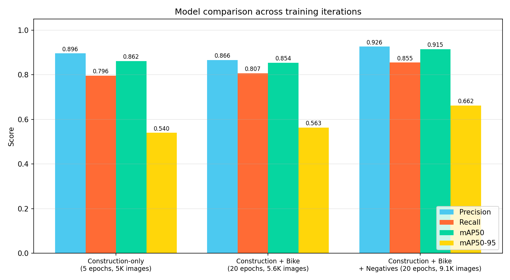
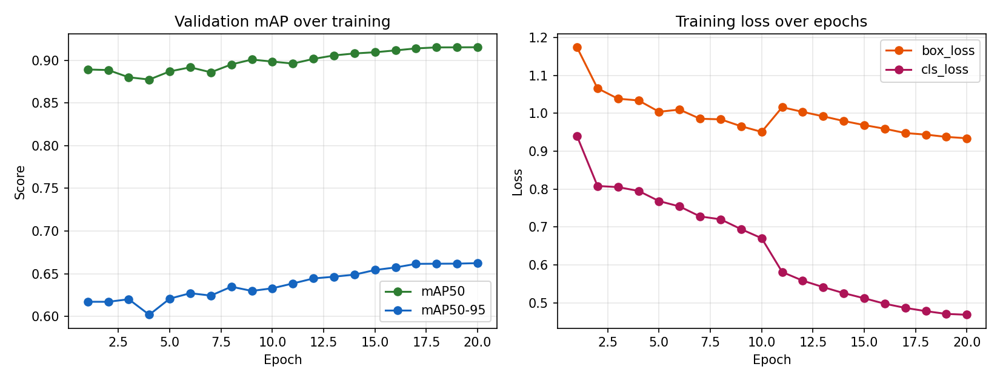
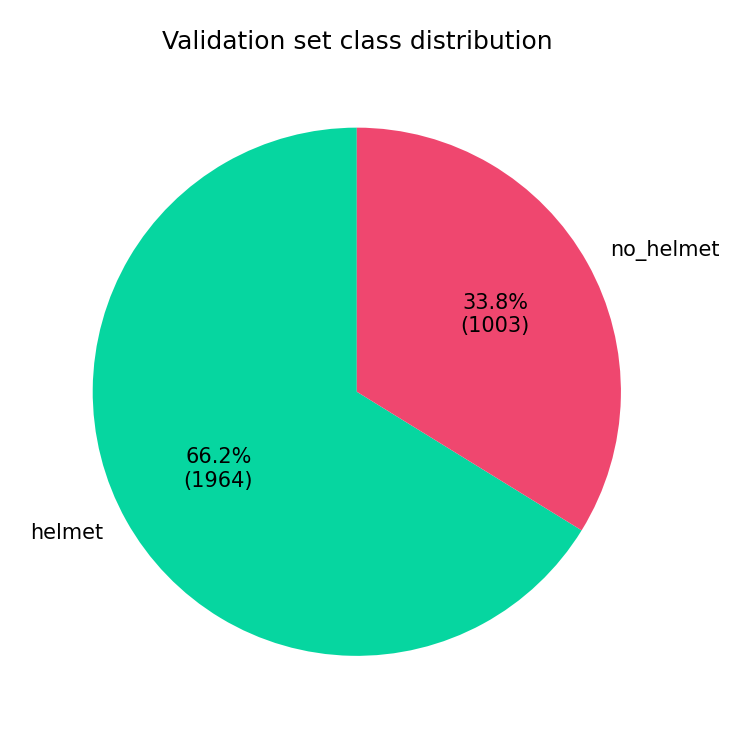
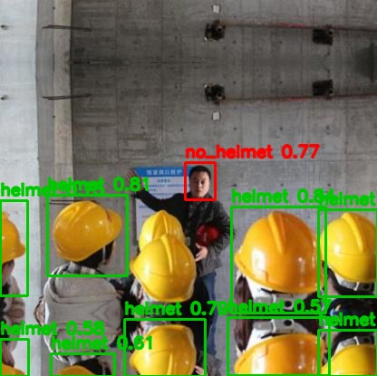
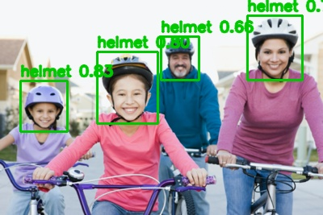

# ⛑️ Helmet Detection

**Real-time safety helmet compliance detection for images and video, built on YOLOv8.**

Detects whether each person in a frame is wearing a helmet — construction hard
hats *and* bike/motorcycle helmets — flags compliance violations, and renders
a live dashboard with per-detection charts. Ships with a fully automated
dataset pipeline that can ingest labeled data from six source types, plus
unlabeled photos as negative examples.

<p align="center">
  
</p>

---

## Table of contents

- [What it detects](#what-it-detects)
- [Results](#results)
- [Screenshots](#screenshots)
- [Tech stack](#tech-stack)
- [Project structure](#project-structure)
- [Running locally](#running-locally)
- [Loading a dataset & training yourself](#loading-a-dataset--training-yourself)
- [Notes & limitations](#notes--limitations)

## What it detects

| Class | Meaning |
|---|---|
| 🟢 `helmet` | person wearing a safety helmet (hard hat *or* bike/motorcycle helmet) |
| 🔴 `no_helmet` | person **not** wearing a helmet — compliance violation |

Both a Streamlit app (image upload, video upload, live webcam, live charts)
and a standalone CLI (`backend/infer_video.py`) are provided.

## Results

The model went through three training iterations — each one is a real,
measured checkpoint, not a hypothetical:

1. **Construction-only** — trained on hard-hat images alone
2. **+ Bike helmets** — merged in a motorcyclist dataset so the model generalizes
   across both domains
3. **+ Negative examples** — merged in ~3,500 unlabeled portrait photos as
   `no_helmet` negatives, fixing a real failure mode where the model flagged
   baseball caps and other everyday headwear as `helmet`

<p align="center">
  
</p>

**Final model** (YOLOv8n, imgsz=640, 20 epochs, 9,093 images / 80-10-10 split):

| Metric    | Value  |
|-----------|--------|
| Precision | 0.926  |
| Recall    | 0.855  |
| mAP50     | 0.915  |
| mAP50-95  | 0.662  |

Per-class mAP50: **helmet 0.952** · **no_helmet 0.878**

<p align="center">
  
  <br>
  
</p>

Trained on three merged sources via `dataset_loader.py`:

- [andrewmvd/hard-hat-detection](https://www.kaggle.com/datasets/andrewmvd/hard-hat-detection) — 5,000 construction-site images (VOC XML)
- [andrewmvd/helmet-detection](https://www.kaggle.com/datasets/andrewmvd/helmet-detection) — 764 motorcyclist images (VOC XML)
- [ashwingupta3012/human-faces](https://www.kaggle.com/datasets/ashwingupta3012/human-faces) — ~3,500 unlabeled portrait
  photos ingested as whole-frame `no_helmet` negatives via `--as-negative-class no_helmet`

## Screenshots

Green boxes mark `helmet` detections, red boxes mark `no_helmet` (compliance
violation) detections — matching the color coding used in the app. Tested on
both domains the model was trained on:

**Construction site** — 9 hard hats detected, 1 supervisor correctly flagged
as a compliance violation:



**Cyclists** — all 4 riders' helmets correctly detected:



Annotated video examples (same model, `backend/infer_video.py`):
[construction site](assets/examples/sample_video_annotated.mp4) ·
[cyclists](assets/examples/sample_bike_video_annotated.mp4)

The Streamlit app also renders these results live — a compliance banner,
per-class metric tiles, a confidence bar chart and donut chart for images,
and a detections-over-time line chart for video.

## Tech stack

- **YOLOv8** (Ultralytics) — object detector
- **PyTorch** — training backend
- **Streamlit** — web app frontend
- **Plotly** — interactive in-app charts
- **OpenCV** — video frame processing and annotation
- **streamlit-webrtc** — live webcam inference in the browser

## Project structure

```
.
├── main.py                     # Entrypoint — launches the Streamlit frontend
├── backend/
│   ├── model.py                 # Model loading + dataset/training metadata helpers
│   ├── inference_image.py       # Single-image inference + annotation
│   ├── infer_video.py           # Video inference/annotation, also runnable as a CLI
│   ├── dataset_loader.py        # Universal dataset auto-loader
│   ├── split_dataset.py         # Train/val/test splitter for YOLO format
│   ├── train_helmet.py          # YOLOv8 training script
│   └── setup_windows_codec.py   # One-time Windows setup for browser-playable video export
├── frontend/
│   └── app.py                   # Streamlit UI — image + video + webcam tabs, charts
├── requirements.txt
├── requirements-space.txt      # Trimmed deps for deploying just the app (no training tools)
├── packages.txt                 # apt deps for cloud deploy (ffmpeg, libgl1, etc.)
├── data/
│   └── helmet/
│       ├── data.yaml            # YOLO dataset config (classes: helmet, no_helmet)
│       ├── images/ (train/val/test)
│       └── labels/ (train/val/test)
├── runs/detect/train3/          # Latest YOLO training run (weights/best.pt, results.csv)
├── assets/
│   ├── examples/                 # Annotated example images and videos
│   └── charts/                   # Generated result charts (this README's graphs)
└── README.md
```

## Running locally

```bash
git clone https://github.com/Faizan4356/Helmet-Detection.git
cd Helmet-Detection
python -m venv venv
venv\Scripts\activate          # Windows
# source venv/bin/activate     # macOS/Linux
pip install -r requirements.txt

# Windows only, one-time: enables browser-playable (H.264) video export.
# Without this, annotated videos still work but only download, not preview inline.
python -m backend.setup_windows_codec

python main.py
# equivalent to: streamlit run frontend/app.py
```

## Loading a dataset & training yourself

The dataset loader accepts six source types and auto-converts labels
(YOLO / Pascal VOC / COCO / CSV) into YOLO format, remapping class names onto
`helmet` / `no_helmet` via a synonym map:

Run these from the project root:

```bash
# Roboflow Universe / Roboflow API
python -m backend.dataset_loader --source "roboflow:API_KEY:workspace/project/version"

# Kaggle dataset (requires ~/.kaggle/kaggle.json)
python -m backend.dataset_loader --source "kaggle:andrewmvd/hard-hat-detection"

# Direct URL to a .zip/.tar.gz archive
python -m backend.dataset_loader --source "https://example.com/helmets.zip"

# Google Drive share link or file id
python -m backend.dataset_loader --source "gdrive:FILE_ID"

# Local folder already on disk
python -m backend.dataset_loader --source "/local/path/to/dataset"

# Hugging Face Hub dataset repo
python -m backend.dataset_loader --source "hf:username/helmet-dataset"

# Unlabeled photo collection as negative examples (see Results above)
python -m backend.dataset_loader --source "kaggle:owner/dataset" --as-negative-class no_helmet
```

Then split and train:

```bash
python -m backend.split_dataset --train 0.8 --val 0.1 --test 0.1
python -m backend.train_helmet --data data/helmet/data.yaml --epochs 100 --imgsz 640
```

Standalone CLI video inference (reuses the same code the app uses):

```bash
python -m backend.infer_video --weights runs/detect/train3/weights/best.pt --source path/to/video.mp4 --output out.mp4
```

Training exports `best.pt`, `last.pt`, `results.csv`, `metrics.json`, and an
ONNX export for portable inference.

## Notes & limitations

- Image size is kept at 640 (not 320) because helmets are small relative to a
  full person/frame — smaller input sizes hurt small-object recall.
- Class remapping relies on a synonym dictionary in `dataset_loader.py`
  (`CLASS_SYNONYMS`). Datasets with unfamiliar class names will have those
  classes skipped with a warning rather than silently mislabeled — extend the
  map if needed.
- `dataset_loader.py --as-negative-class no_helmet` ingests an unlabeled photo
  collection as whole-frame negatives of the given class — useful for teaching
  the model what backgrounds/objects are *not* a helmet (e.g. everyday
  headwear) when no proper annotations exist for that data. It's a coarse
  weak label (the whole frame, not a tight box), so use it as a supplement
  to properly annotated data, not a replacement.
- The live webcam tab requires `streamlit-webrtc` and a browser with camera
  access; it will not work in headless/server-only environments.
- Video processing speed can be traded for accuracy via the frame-sampling
  stride slider in the Video Detection tab.
- The final model completed 20 epochs but mAP was still trending upward, not
  yet plateaued — a full `--epochs 100` run (default, with `--patience 15`)
  would likely score higher still. `train_helmet.py --resume` picks up from
  `weights/last.pt` if you want to continue.
- On Windows with a low-VRAM GPU, multi-process dataloader workers
  (`--workers` > 0) can crash with a `pickle data was truncated` /
  `OSError: [Errno 22]` error during `torch`'s worker spawn. If you hit
  this, pass `--workers 0` (single-process loading, slower but reliable)
  or `--workers 1`/`2`. `--cache ram` is recommended for small datasets
  regardless — it avoids re-decoding images every epoch.
